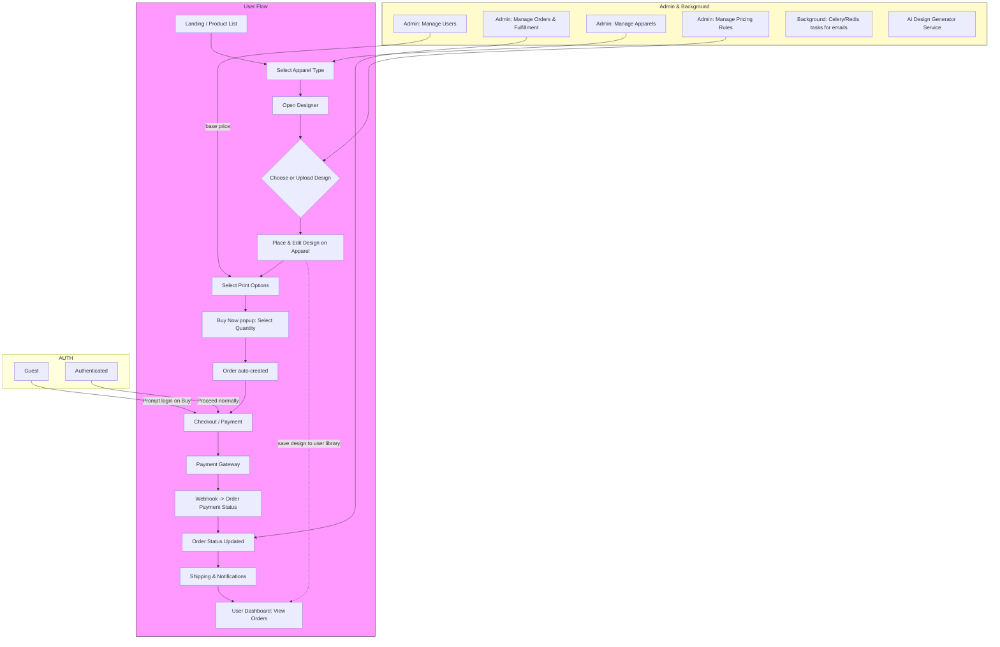

# Custom Apparel Design (CAD)

**One-line:** Web application that lets users design and purchase personalized apparel (T-shirts, caps, etc.) by selecting/uploading designs, placing them on products, and checking out.

---

## Table of Contents

* [Project Overview](#project-overview)
* [Key Features](#key-features)
* [High-level Flowchart](#high-level-flowchart)
* [Data & Pricing Model](#data--pricing-model)
* [Setup & Run (Dev)](#setup--run-dev)
* [How the Flow Works (step-by-step)](#how-the-flow-works-step-by-step)
* [Admin & Background Services](#admin--background-services)
* [Contributing](#contributing)
* [License](#license)

---

## Project Overview

This repository implements a Custom Apparel Design (CAD) system where users can:

* Select an apparel type (T-shirt, cap, hoodie, etc.)
* Choose from built-in designs or upload their own
* Position and scale designs onto the chosen apparel preview
* Select printing method, either Screen Printing or Embroidery
* Select quantity (via a "Buy Now" popup)
* Place a one-time order which is created automatically on confirmation
* Pay via an integrated payment gateway - Stripe
* Receive order/shipping/activity notifications

The system also provides admin interfaces for managing users, apparels, base prices and order fulfillment.

---

## Key Features

* Visual product designer (drag/scale/place design)
* Upload and manage user designs
* Admin-managed `PricingRules` model for base prices per apparel type
* Additional cost modifiers (print method, color count, custom artwork) applied in code
* `Buy Now` flow that creates an order immediately
* Or `Draft` your creation to modify or place order for later
* Payment gateway integration and webhook handling
* Notifications via email/SMS (e.g., Twilio)
* AI-assisted design generation

---

## High-level Flowchart

> The diagram below uses **Mermaid** syntax. GitHub and many markdown renderers support Mermaid. If your renderer doesn't show the diagram, use a Mermaid live editor, or open this file in VS Code with a Mermaid preview extension.



---

## Data & Pricing Model

* **PricingRules (model)** — holds base price per apparel type (editable by admin).
* Additional costs (e.g., print method, number of colors, custom artwork complexity) are calculated in application logic.
* Orders are created when user confirms 'Buy Now' (no manual admin step required to create the order).

---

## Setup & Run (Dev)

```bash
# create virtual env
python -m venv env
source env/bin/activate
pip install -r requirements.txt

# set up environment variables in .env (DATABASE_URL, SECRET_KEY, STRIPE_KEYS, TWILIO_*, CELERY_BROKER_URL, etc.)

python manage.py migrate
python manage.py runserver
python manage.py create_superuser

# celery (example)
celery -A project_name worker -l info
```

---

## How the Flow Works (step-by-step)

1. User browses products and selects an apparel type.
2. User opens the designer: either chooses a built-in art or uploads their own image.
3. User places, scales, and positions the art on the product mockup.
4. User selects print method, color choices and other options. Admin `PricingRules` base price is fetched and additional costs applied.
5. User clicks **Buy Now** and selects quantity in the popup. The app auto-creates an `Order` record.
6. User proceeds to checkout and completes payment via integrated gateway.
7. Payment gateway sends a webhook to your server to confirm payment. The webhook updates the order status (paid/failed).
8. On payment confirmation, background tasks send notifications (email/SMS) and the order moves to fulfillment.
9. Admin can manage orders, mark shipments, and update statuses; users can track orders in their dashboard.

---

## Admin & Background Services

* **Admin Dashboard**: Manage `PricingRules`, users, apparels, view and process orders, configure shipping details.
* **Background Workers**: Use Celery + Redis for sending emails, PDF generation (invoices), and scheduled tasks.
* **Webhook Endpoint**: Securely validate gateway webhooks and reconcile order payment status.
* **Notifications**: Email via configured SMTP service; SMS via Twilio.

---

## Contributing

1. Fork the repo
2. Create a feature branch: `git checkout -b feat/your-feature`
3. Make changes and add tests
4. Create a PR describing your changes
